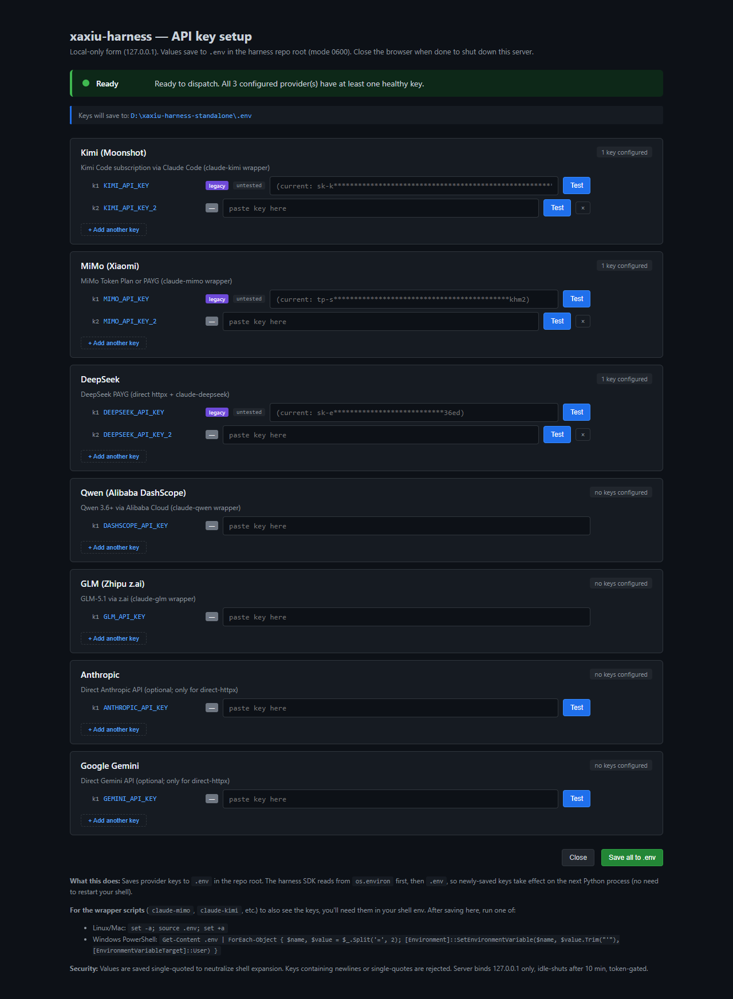

# xaxiu-harness — operator guide

> Single source of truth for the operator running xaxiu-harness day-to-day.
> Replaces the pre-consolidation set: `OPERATOR_QUICKSTART.md` + `OPERATOR_RUNBOOK.md` + `INTERNAL_OPERATOR_RUNBOOK.md` + `HARNESS_VISUAL_MANUAL.md` + `USING_HARNESS_FROM_OTHER_PROJECTS.md`.

## What xaxiu-harness is

xaxiu-harness is your command surface and observability layer for delegating dev work to multiple LLMs. Three operating modes, low → high autonomy:

1. **Cross-engine panel** (`harness ask`) — fire the same question at 3+ engines in parallel; compare answers side-by-side. The "second opinion" mode for high-stakes decisions. Costs $0.20-0.30 per panel via Pattern B routing.

2. **Agentic dev manager** — single Claude session orchestrating work in real time, with full dev authority, captured directives (parallelism, kill conditions, L5 escalation threshold), forensic audit trail, per-engine budget caps.

3. **Multi-agent coordinator** (`harness coord`) — Planner/Worker pattern with isolated git worktrees, stateful 4-key API proxy with circuit breaker + auto-quarantine, replan-from-failure, integration phase. The mode that justifies the proxy + worktree + multi-key infra; for autonomous overnight runs.

Underneath all three: cross-platform key resolution, JSONL audit ledger with redaction, replay/decision archaeology, heartbeat + status tracker + observer flags, session-handoff monitor, FastAPI dashboard with WebSocket telemetry.

Designed for a single non-technical operator. Runs entirely on your laptop — no server, no cloud.

---

## Table of contents

1. [Fresh-machine setup (~30 min)](#1-fresh-machine-setup)
2. [Daily commands with screenshots](#2-daily-commands)
3. [Three operating modes — when to use which](#3-operating-modes)
4. [Using the harness from any project directory](#4-using-from-other-projects)
5. [Maintenance procedures](#5-maintenance) — key rotation, recovery from crash, engine quarantine
6. [Troubleshooting + escalation](#6-troubleshooting)
7. [What lives where (filesystem map)](#7-filesystem-map)
8. [Glossary + further reading](#8-glossary)

---

## 1. Fresh-machine setup

If you've done this before and just need the cheat sheet, jump to [§ 2](#2-daily-commands).

### 1.1 Prerequisites

| Tool | Why | Get it from |
|---|---|---|
| **Python 3.13** (or 3.11+) | Runs the harness | https://www.python.org/downloads/ |
| **Git** | Clones the repo | https://git-scm.com/downloads |
| **Claude Code CLI** | Pattern B engines route through Claude Code's subscription | https://docs.claude.com/en/docs/claude-code/setup |

Total install time if you have none: ~10-15 min.

### 1.2 Clone and install

```bash
git clone https://github.com/xaxiuegg/xaxiu-harness.git
cd xaxiu-harness
python -m venv .venv
```

Activate the venv:

- **Windows PowerShell**: `.venv\Scripts\Activate.ps1`
- **Windows Git Bash**: `source .venv/Scripts/activate`
- **Mac/Linux**: `source .venv/bin/activate`

Then install:

```bash
pip install -e .
```

Takes ~30 seconds. Verify:

```bash
python -m harness --help
```

> **Why `python -m harness` and not just `harness`?** On Windows + Git Bash, the `harness.exe` shortcut isn't always on PATH. `python -m harness` always works whenever `import harness` works.

### 1.3 Configure API keys

You need at least one provider key. The harness handles missing engines gracefully.

**Easiest path: the keys UI.**

```bash
python -m harness keys serve
```

This opens a browser form at `http://127.0.0.1:<random-port>` where you can:
- Paste each provider's API key (up to 4 slots per provider for redundancy)
- Click **Test** to verify each key (live probe to the provider)
- Click **Save all to .env** to write to your repo's `.env` (mode 0600 on POSIX)

| Provider | Get a key at | Notes |
|---|---|---|
| Kimi (Moonshot) | https://platform.moonshot.cn/ | Recommended — subscription pricing via Kimi Code |
| MiMo (Xiaomi) | https://mimo.xiaomi.com/ | Cheapest — $50/mo Token Plan ≈ 6,200 panels |
| DeepSeek | https://platform.deepseek.com/ | Fastest at high concurrency; PAYG |
| Anthropic | https://console.anthropic.com/ | Optional |
| Gemini | https://aistudio.google.com/ | Optional |
| Qwen (Alibaba) | https://dashscope.console.aliyun.com/ | Optional |
| GLM (Zhipu z.ai) | https://www.bigmodel.cn/ | Optional |

The keys UI binds to `127.0.0.1` only (never reachable from the network) and is token-gated per session.

**Alternative: edit `.env` by hand.**

```bash
cp .env.example .env
# Then edit .env in your text editor
```

### 1.4 Verify everything's wired up

```bash
python -m harness doctor
```

Eight-check traffic light:

- `python` — interpreter version
- `git` — installed + identity set
- `claude_binary` — Claude Code CLI present (required for Pattern B engines)
- `dpapi` — Windows encrypted-secrets store (skipped/warns on POSIX)
- `engine_keys` — per-key inventory: DPAPI / ENV / UNSET per provider
- `coord_dir` — `coord/` is writable
- `task_scheduler` — Windows-only; relevant for autonomous mode

For real network validation (catches expired/typo'd keys that the presence check can't):

```bash
python -m harness doctor --probe
```

This adds a ~5-token live round-trip per configured engine. Costs a few cents per run.

Each check is independent + has an actionable `fix:` hint when red. Exit code: `0` if all green or warn, `1` if any fail.

### 1.5 Run your first cross-engine panel

```bash
python -m harness ask "what's a good first project for learning Python?"
```

Dispatches to Kimi + MiMo + DeepSeek in parallel. Takes 30s-2min. Writes everything to `coord/reviews/ask-<timestamp>-<slug>/`:

- `question.md` — your question (for re-runs)
- `kimi-via-claude.md` — Kimi's response
- `mimo-via-claude.md` — MiMo's response
- `deepseek-via-claude.md` — DeepSeek's response
- `packet.md` — all three concatenated (synthesis-ready)
- `summary.json` — programmatic metadata

Typical cost: **$0.20-0.30 total** for an audit-class exchange (~1500 tokens in, ~500 out per engine). Trivial prompts (e.g. "reply OK") cost ~$0.01-0.02 per engine; costs scale linearly with token volume.

### 1.6 Optional: install wrapper scripts

For interactive use (chatting directly with an engine):

```bash
python -m harness engines install-wrappers
```

Creates shortcuts under `~/.harness/bin/`:

- `claude-kimi "your prompt"` — interactive Claude Code session routed to Kimi
- `claude-mimo "..."` — same for MiMo
- `claude-deepseek "..."` — same for DeepSeek

Add `~/.harness/bin` to your PATH (the command prints the exact line for your shell).

These wrappers give you the full Claude Code experience (tools, multi-turn, in-place edits) routed to whichever provider you pick. Use them when you want to chat interactively rather than dispatch programmatically.

### 1.7 Optional: clone xaxiu-swarm for agentic multi-file dispatch

Only needed if you want **swarm-style agentic dispatch** (multi-file refactors, batch parallel work). NOT required for `harness ask`, `harness coord`, or any of the operating modes covered in this guide.

```bash
cd ..  # back out of xaxiu-harness
git clone https://github.com/xaxiuegg/xaxiu-swarm.git
cd xaxiu-swarm && pip install -e .
xaxiu-swarm backends   # verify
```

You should see `claude-mimo`, `claude-kimi`, `claude-deepseek` (TOS-safe agentic family) plus the legacy `deepseek`, `kimi`, `kimi-api` paths.

---

## 2. Daily commands

Four-command bedrock for working installs:

```bash
python -m harness setup       # one-time onboarding (or after re-clone)
python -m harness keys serve  # add or rotate API keys via browser
python -m harness doctor      # health check
python -m harness ask "..."   # cross-engine panel — your daily driver
```

Everything else is power-user surface. The walkthroughs below show what each one looks like and when to reach for them.

### 2.1 `harness doctor` — preflight diagnostics

Run first whenever something feels off, or after any install/clone.

```
harness doctor — preflight diagnostics
==================================================
  [OK] python           Python 3.13 OK
  [OK] git              git installed + identity set
  [OK] claude_binary    claude installed: 2.1.150 (Claude Code)
  [OK] dpapi            DPAPI read works
  [OK] engine_keys      KIMI_API_KEY:ENV, DEEPSEEK_API_KEY:ENV, ANTHROPIC_API_KEY:UNSET,
                        GEMINI_API_KEY:UNSET, MIMO_API_KEY:ENV, OPENAI_API_KEY:UNSET |
                        mimo=tokenplan (run `harness doctor --probe` for live network validation)
  [OK] coord_dir        coord/ is writable
  [OK] task_scheduler   Task Scheduler reachable
==================================================
overall: OK
```

**Severity legend**:

| Glyph | Severity | What it means | What to do |
|---|---|---|---|
| `[OK]` (green) | OK | This check passed | Nothing — move on |
| `[!]` (yellow) | WARN | Works but worth knowing | Read the message; usually safe to ignore unless you want that feature |
| `[X]` (red) | FAIL | Broken — dispatch will likely fail until resolved | Read the `fix:` line + run that command |

**Common failures + fixes**:

| Check failing | What you'll see | Fix |
|---|---|---|
| `python` | `Python 3.10 too old (need ≥3.11)` | Install Python 3.11+ from python.org |
| `claude_binary` | `claude CLI not found on PATH` | Install Claude Code, restart shell, re-run |
| `engine_keys` | `no engine API keys configured` | Run `harness keys serve` and paste at least one key |
| `dpapi` (Windows) | `DPAPI unreadable` | This is an L5 — escalate (see § 6.2) |
| `coord_dir` | `can't write to coord/` | Check filesystem permissions |

**`--probe` flag** (P2 audit fix 2026-05-27): live network round-trip per configured engine. Adds a few seconds and a few cents. Catches dead/expired/typoed keys that simple presence checks miss.

### 2.2 `harness setup` — one-shot guided onboarding

Use this on a brand-new machine, or after re-cloning into a fresh checkout.

```
============================================================
  xaxiu-harness setup wizard
============================================================
  Guided walkthrough from blank machine to first dispatch.
  Press Ctrl+C at any time to abort + return to your shell.

--- Step 1/5: Run preflight diagnostics (harness doctor) ---
  ✓ All 8 checks pass — no setup issues to fix

--- Step 2/5: Claude Code CLI availability check ---
--- Step 3/5: API key configuration ---
  ✓ API keys already configured — skipping keys UI

--- Step 4/5: Wrapper script installation ---
  ✓ All 6 wrapper scripts already installed at C:\Users\xaxiu\.harness\bin

--- Step 5/5: Smoke dispatch ---
  • Firing a 'say OK' dispatch through the first available Pattern B engine...
============================================================
  Setup wizard complete
============================================================
```

Five steps, all consent-gated. If you've already done a step, the wizard detects it and skips. Safe to re-run.

`--non-interactive` accepts defaults at every prompt (skip browser-opens + real dispatch). Suitable for CI / scripted bootstrap.

### 2.3 Sanity-check the install actually works

After setup, before trusting the install, run one cheap real dispatch:

```bash
python -m harness ask "Reply with the single word OK." \
    --engines mimo-via-claude --no-save --max-budget-usd 0.05
```

Expected within ~30s:

```
engine                   OK   elapsed    in     out    cost       alias
---------------------------------------------------------------------------
  mimo-via-claude        OK    8.1s     43     12    $0.0042   k1

  total cost: $0.0042
```

**If you get an error instead:**

| Symptom | What it means | Try |
|---|---|---|
| `FAIL no API key configured` | `.env` or env has no key for that engine | `harness keys serve` → paste, save, retry |
| `FAIL subprocess timeout` | Dispatch ran longer than `--max-budget-usd` allowed | Raise the cap: `--max-budget-usd 0.20` |
| `FAIL claude binary not found` | Claude Code CLI isn't installed | Install from claude.com, re-run |
| `command not found: harness` | Wrong Python environment | `pip install -e .` from repo root, or use `python -m harness` |

### 2.4 `harness keys serve` — the multi-key web UI

How you paste / rotate / test API keys. Binds to `127.0.0.1` only (loopback, never reachable from the network) and is gated by a single-session random token.

```
$ python -m harness keys serve
harness keys ui ready at http://127.0.0.1:50373/?token=...
  binds to 127.0.0.1:50373 only
  token-gated; idle timeout 600s
  CTRL+C to exit (or just close the browser).
```

The browser opens to:



**What you see**:

| Element | What it tells you |
|---|---|
| Green "Ready" status pill at top | Dispatch-readiness: all configured providers have at least one healthy key. Yellow = degraded with fallback. Red = a provider has zero healthy keys. |
| Path info ("Keys will save to: ...") | Where keys land — always under repo root, mode 0600 on POSIX |
| Per-provider rows (Kimi / MiMo / DeepSeek / Qwen / GLM / Anthropic / Gemini) | One card per provider, with "N key configured" badge |
| Per-slot rows (k1, k2, k3, k4) | Slot number, env var name (e.g. `KIMI_API_KEY_2`), source badge (legacy/shell/.env/dpapi/—), health badge (up/category/untested), password input, Test button, × remove |
| **+ Add another key** button | Adds a new slot (up to 4 per provider) |
| **Strategy dropdown** | `rotation` (default), `priority`, or `failover-only`. Writes to `coord/key_policy.json`. |
| **Test button per slot** | Live-probes via `probe_engine_live`. Records to health ledger. |
| **× remove button** | Marks slot for deletion on Save |
| **Save all to .env** (bottom right) | Writes changed slots with proper quoting + 0600 mode |

The footer documents the protection model: values single-quoted to neutralize shell expansion on `source .env`, newlines/single-quotes in pasted keys rejected, server binds loopback only, idle-shuts after 10 min, token-gated.

### 2.5 `harness ask` — your daily-driver cross-engine panel

The single command you'll run most often.

```
$ python -m harness ask "Name three benefits of cross-engine LLM panels in one bullet each."
[ask] firing 3 engines in parallel (budget $0.30 each, timeout 180s)...
      output: D:\xaxiu-harness-standalone\coord\reviews\ask-20260526-220035-name-three-benefits...

engine                   OK   elapsed    in     out    cost       alias
---------------------------------------------------------------------------
  kimi-via-claude        OK   18.2s    694    287    $0.0091   k1
  mimo-via-claude        OK   81.6s    427    179    $0.0078   k1
  deepseek-via-claude    OK   10.9s   1052    243    $0.0188   k1

  total cost: $0.0357
  saved 3 response files + packet.md + summary.json
```

**What it does**:

1. Fires 3 Pattern B engines in parallel: `kimi-via-claude`, `mimo-via-claude`, `deepseek-via-claude`.
2. Each dispatched via `dispatch_with_pool` — automatic multi-key failover if a key is unhealthy.
3. Records outcomes to `coord/key_health.jsonl` so future selection consults real data.
4. Saves to `coord/reviews/ask-<ts>-<slug>/` with `question.md`, per-engine `*.md`, `packet.md` (synthesis-ready), and `summary.json`.

**Key flags**:

```bash
harness ask "..."                              # default: 3 engines, full save
harness ask --file question.md                 # read question from file
harness ask "..." --engines mimo-via-claude    # single engine
harness ask "..." --max-budget-usd 0.50        # raise per-engine spend cap
harness ask "..." --print-text                 # dump full response to stdout
harness ask "..." --no-save                    # skip saving to disk
harness ask "..." --output /tmp/my-panel       # custom output dir
```

Typical 3-engine audit-class panel: **$0.20-0.30 total**, 30s-2min.

### 2.6 `harness engines recommend` — empirical routing

Don't guess which engine to use. Ask the recommender:

```
$ harness engines recommend default
mimo-via-claude
  rationale: MiMo-via-claude scored 100% on a 10-prompt production corpus + cheapest...
  alternates: deepseek-via-claude, kimi-via-claude

$ harness engines recommend latency
deepseek-via-claude
  rationale: DeepSeek-flash at 10.2s avg, fastest on every category.

$ harness engines recommend audit
deepseek-via-claude (model_override: deepseek-v4-pro)
  rationale: Audit step needs a DIFFERENT engine than the producer.
```

| Task class | Returns | When to use |
|---|---|---|
| `default` | mimo-via-claude | Routine code/reasoning |
| `latency` | deepseek-via-claude | Speed-critical (panels, dashboards) |
| `verbose` | kimi-via-claude | Detailed elaboration / writeups |
| `cost` | mimo-via-claude | High-volume batch dispatch |
| `high-volume` | mimo-via-claude | 100s+ dispatches |
| `multimodal` | mimo-via-claude | Markdown image refs in prompts |
| `audit` | deepseek-via-claude (v4-pro override) | Ship-critical cross-engine verification |

Engine name → stdout (pipe-friendly); rationale → stderr. So `$(harness engines recommend default)` returns just `mimo-via-claude`.

Backing data: [`spec/engine-routing-empirical.md`](../spec/engine-routing-empirical.md).

### 2.7 `harness keys list` — per-slot status table

```
$ python -m harness keys list

provider               env var                source      key (masked)               health
----------------------------------------------------------------------------------------------------
  Kimi (Moonshot)      KIMI_API_KEY           env-legacy sk-k****************...ApSf  untested
  MiMo (Xiaomi)        MIMO_API_KEY           env-legacy tp-s******************khm2   up
  DeepSeek             DEEPSEEK_API_KEY       env-legacy sk-e******************36ed   untested
  Anthropic            ANTHROPIC_API_KEY      missing    (not set)
```

Source column: `env` / `env-legacy` / `dotenv` / `dpapi` / `missing`.

Health column: `up` / `auth-failed` / `quota-exceeded` / `terminated` (= quarantined) / `untested`.

`--format json` for programmatic consumption.

### 2.8 Other useful verbs

For full surface: `harness --help` or `harness capabilities` (programmatic snapshot).

```bash
# Engine inspection
harness engines list                   # priority/locked/status per engine
harness engines health                 # live-dispatch probe (real call, ~$0.01)
harness engines failures               # last 7d failure summary by category
harness engines install-wrappers       # install claude-mimo / claude-kimi / etc.

# Key management
harness keys probe-all                 # live-test every populated slot
harness keys policy get                # show per-provider strategy
harness keys policy set <prefix> <strat>  # rotation / priority / failover-only
harness keys forget <prefix> <alias>   # clear health history for a key

# Budget + audit
harness budget show                    # per-engine spend + unpriced flags
harness budget summary --since 2026-05  # per-engine totals + grand total
harness cost-today                     # operator-readable cost widget
harness audit show                     # forensic dispatch ledger (redacted)
harness audit summary --since-hours 24

# Operating state
harness today                          # last 24h activity summary
harness morning-brief                  # daily op brief (issues, commits, engines)
harness preflight                      # readiness gate
harness dashboard-serve                # FastAPI dashboard on 127.0.0.1:7878
```

---

## 3. Operating modes

The harness has three operating modes. Pick by autonomy level — how much you want to delegate vs supervise.

### 3.1 Cross-engine panel (low autonomy)

**Verb**: `harness ask "..."`

**When**: high-stakes decisions, design reviews, "second opinion" on a piece of code, anything where one engine's blind spot could cost you. Routine prompts don't need this — it costs $0.20-0.30 per panel.

**How it works**: same prompt to 3 engines in parallel, outputs saved side-by-side as comparable .md files. `packet.md` concatenates all 3 (hand to a Claude Code session for synthesis, or read directly).

**What you control**: which engines (`--engines`), budget cap (`--max-budget-usd`), output destination (`--output`).

This is the mode most operators use 90% of the time.

### 3.2 Agentic dev manager (medium autonomy)

**Verb**: in-session Claude with the harness available.

**When**: you're using Claude Code on a coding task and want it to delegate sub-questions or verifications to other engines, without spawning a separate process tree.

**How it works**: Claude Code session has the harness on PATH (`agent-instructions install` sets this up — see § 4). When Claude needs a second opinion or a cross-engine check, it runs `harness ask` itself and reads the output. You stay in the Claude conversation; the harness is just a sub-tool.

**What you control**: Claude's directives in your CLAUDE.md or session — kill conditions, parallelism, escalation thresholds. The harness captures these as enforceable config (per-engine budget caps, automated cooldowns on engine failure, L5 escalation on fatal errors).

This is the mode this very document was edited in.

### 3.3 Multi-agent coordinator (high autonomy)

**Verb**: `harness coord <subcommand>`

**When**: long-running autonomous runs against a spec — multiple workers in parallel git worktrees, each one-shot, all coordinated. The mode that justifies the proxy + worktree + 4-key pool infra. Overnight batch work; spec-driven feature waves.

**How it works** (13 subcommands; see `harness coord --help`):

```bash
harness coord plan      --spec spec/wave-X.md          # Planner: spec → WavePlan JSON
harness coord run       --spec spec/wave-X.md --run-id <id> --max-workers 24
harness coord work      --run-id <id> --worker-id worker-3 ...
harness coord status    --run-id <id>
harness coord watch     --run-id <id>                  # tail live events
harness coord integrate --run-id <id>                  # merge worker branches
harness coord retry     --run-id <id> --worker-id worker-3
harness coord rerun-failed --run-id <id>
harness coord replan    --run-id <id>                  # planner sees failure context
harness coord list                                      # all runs/ with state
harness coord cancel    --run-id <id>
harness coord cleanup   --run-id <id>                  # drop worktrees + state
harness coord plan-from-description "..."              # NL → plan.json
```

**Architecture** (full spec: [`spec/multi-agent-harness-architecture.md`](../spec/multi-agent-harness-architecture.md)):

- **Coordinator** is a long-running daemon (or invoked per-run) holding the lock on `runs/<id>/run.json`.
- **Planner** is a one-shot Claude/Kimi call producing a `WavePlan` JSON. If a worker fails with `needs_replan: true`, the coordinator calls planner again with failure context.
- **Workers** are one-shot Kimi/MiMo/DeepSeek subprocesses, each in its own git worktree at `worktrees/<run>/<worker-id>/`. Workers never read or write the main checkout — eliminates the cli.py-collision class of failures.
- **Stateful proxy** (`harness proxy start`) holds the 4-key pool with per-key circuit breaker + auto-quarantine on flap. Goal: 24 in-flight at pool level even when one key is in cooldown.
- **Integrator** merges worker branches after all report success.

**State on disk**:

```
runs/<run-id>/
├── run.json              # coordinator-owned overall state
├── plan.json             # planner output (immutable after creation)
├── checkpoints/
│   └── worker-N.json     # per-worker resume state
└── deliverables/
    └── worker-N.json     # structured worker output

worktrees/<run-id>/
└── worker-N/             # git worktree on branch wt/<run>/<worker>
```

**Resume**: every restart re-enters the loop; the lock guards against concurrent coordinators. Workers are idempotent within their own worktree.

**When to actually reach for this** (operator-honest):

- You have a spec broken into ~3-12 independent file-disjoint tasks (the planner's sweet spot).
- You want to fan out to multiple engines without holding a Claude session open.
- You're OK paying the up-front spec-writing cost to get autonomous execution.

If your task is "one file, one engine, one prompt" — use `harness ask` instead. The coord overhead isn't worth it.

### 3.4 How the modes layer

All three modes share the same substrate: cross-platform key resolution, JSONL audit ledger, replay, budget meter, observer flags, dashboard. Picking a mode doesn't lock you in — you can run a `harness ask` panel mid-`coord` run, or have a Claude session inspect a coord run's state.

---

## 4. Using from other projects

Once `pip install -e .` is done in the harness repo, the CLI works from any directory. Outputs land in the harness repo's `coord/reviews/`, not the calling project — your project dirs stay clean, all panel history accumulates in one place.

### 4.1 The "harness follows you" model

```bash
# In any project directory:
cd ~/Projects/my-new-thing
python -m harness ask "should I use sqlite or postgres for this?"
# → fires the panel, saves to <harness-repo>/coord/reviews/ask-<ts>-<slug>/
```

| What | Where | Purpose |
|---|---|---|
| Python source | `<repo>/src/harness/` | Package code, edited in place |
| Editable install link | `<python-site-packages>/xaxiu-harness.egg-link` | Points back at the repo |
| `harness` CLI binary | `<python-scripts>/harness.exe` (Windows) or `<python-bin>/harness` (POSIX) | `python -m harness` if PATH issues |
| `.env` (keys) | `<repo>/.env` | Read regardless of cwd via `_resolve_env_path()` walking up |
| `coord/` (state + reviews) | `<repo>/coord/` | All `harness ask` outputs land here |
| `~/.harness/` | `C:\Users\<you>\.harness\` or `~/.harness/` | Per-machine: forensic audit ledger, wrapper scripts |

Find your install path anytime:

```bash
python -c "import harness; from pathlib import Path; print(Path(harness.__file__).resolve().parents[1])"
```

Or print the operator-friendly snippet with the path baked in:

```bash
python -m harness agent-instructions --format short
```

### 4.2 Teaching a new agent session that the harness exists

By default, a Claude Code session opened in `~/Projects/my-new-thing/` has no idea xaxiu-harness is installed. Three options:

**Option 1: User-level Claude Code memory (recommended — set once)**

```bash
python -m harness install-agent-instructions
```

Idempotent. Appends a marker-gated section to `~/.claude/CLAUDE.md`. Every Claude Code session you start, in any directory on this machine, has the harness in its context. No per-session paste required.

`--uninstall` removes cleanly. `--force` replaces a corrupted block. `--target <path>` for per-project install.

**Option 2: Per-project CLAUDE.md**

If a specific project should know about the harness but you don't want it global:

```bash
cd ~/Projects/my-new-thing
python -m harness agent-instructions --format claude-md >> CLAUDE.md
```

**Option 3: One-shot paste**

No persistent config. Just paste this into a new agent session when you want to use the harness:

```bash
python -m harness agent-instructions --format prompt | clip     # Windows
python -m harness agent-instructions --format prompt | pbcopy   # macOS
python -m harness agent-instructions --format prompt | xclip    # Linux
```

Then paste into the agent.

### 4.3 Common cross-project patterns

**Pattern: "Get a second opinion on this design"**

In Claude Code in your project session, tell it:

> Get a second opinion on whether we should use sqlite or postgres for this side project. Make sure to look at the harness ask output's packet.md for synthesis.

If your CLAUDE.md has the agent-instructions section, Claude Code will:

1. Run `python -m harness ask "should this side-project use sqlite or postgres? trade-offs?"`
2. Read the resulting `coord/reviews/ask-<ts>/packet.md`
3. Synthesize the 3 engines' perspectives for you

**Pattern: "Ship-critical decision needs DeepSeek v4-pro audit"**

> Use `python -m harness engines recommend audit` to pick the audit engine, then run `harness ask` with that engine + model override on the decision below.

The agent:

1. Runs the recommender, sees `deepseek-via-claude` with `model_override: deepseek-v4-pro`
2. Runs `python -m harness ask "..." --engines deepseek-via-claude` with audit settings
3. Shows the result

### 4.4 Limitations + edge cases

- **Multiple Python environments**: `pip install -e .` only registers in ONE venv. In other venvs, `python -m harness` won't work. Either always use the install venv, re-install in each (it's editable, points back at the same repo), or use global Python for harness invocations.
- **Multiple machines**: each needs its own clone + install + key config. `.env` and `coord/key_health.jsonl` do NOT auto-sync. Re-run `python -m harness keys serve` on each new machine, or commit a redacted `.env.example` (already shipped).
- **Renaming or moving the repo**: the egg-link points at the install path. Re-run `pip install -e . --force-reinstall` to refresh.

---

## 5. Maintenance

### 5.1 When an API key needs rotating

**Path A — keys UI (recommended)**

```bash
python -m harness keys serve
```

Open the URL, paste the new value in the relevant slot, click **Test** (live probe), click **Save all to .env**. The UI writes atomically with 0600 mode.

**Path B — direct edit**

```bash
# 1. Get new key from the engine's platform UI
# 2. Edit .env:
#    KIMI_API_KEY=sk-NEW-VALUE
# 3. (Windows) Update DPAPI cache if you use it:
PYTHONPATH=src python -c "from harness.secrets.dpapi import encrypt_secret; encrypt_secret('KIMI_API_KEY', 'sk-NEW')"
# 4. Test:
python -m harness doctor --probe
# 5. If probe fails: revert the .env (or DPAPI) to the old key
```

### 5.2 When an engine goes down

The harness has automatic recovery — circuit breakers + cooldowns handle most transient failures.

**Check what the harness thinks**:

```bash
python -m harness doctor --probe        # live probe per configured engine
harness engines reliability             # historical success rate per engine
harness engines cooldowns               # which engines are currently quarantined
harness engines failures                # last 7d failure summary by category
```

**Test one engine in isolation**:

```bash
PYTHONPATH=src python -c "
import harness
r = harness.dispatch('reply OK', engine='kimi')
print('success:', r.success)
print('error:', r.error_excerpt)
print('engine:', r.engine_used)
"
```

**Forced fallback** — if Kimi is down, `harness ask` with default engines still works because MiMo + DeepSeek are independent. For direct dispatches:

```bash
PYTHONPATH=src python -c "import harness; print(harness.dispatch('test', engine=['deepseek','mimo']).engine_used)"
```

**Reset health history for a recovered key**:

```bash
harness keys forget KIMI_API_KEY k2
```

### 5.3 When something looks wrong (debugging)

Three commands answer "what's the harness doing right now?":

```bash
harness today                          # last 24h activity + L5 events
harness morning-brief --since-hours 12 # longer overnight handoff
harness observer flags                 # any escalations needing attention
```

If `harness observer flags` shows HIGH severity, that's the harness asking for help. Read the message; include `harness panic-dump` output when escalating (secret-scrubbed; safe to share):

```bash
harness panic-dump --target-dir .
```

### 5.4 When `preflight` shows `[X]` — recovery

The harness has a single command that fixes the three most common problems:

```bash
harness preflight --fix --dry-run      # preview first
harness preflight --fix                # apply
```

This handles:

1. **`[X] git_clean`** — modified files not committed. By default `--fix` does NOT silently stash (W9-PREFLIGHT-FIX-NOSTASH). Either commit/stash manually OR re-run with `--allow-stash`.
2. **`[X] pytest_cache`** — leftover from testing. `--fix` clears it.
3. **`[!] dead_engines`** — an engine stopped working. `--fix` quarantines it so the dispatcher routes around. Reset with `harness engines reset <name>` once the underlying issue is fixed.

For a richer dead-engine view + key-presence probe: `harness engines heal`.

### 5.5 When your laptop dies

Everything important EXCEPT runtime state is in git. You lose:

- Dispatch cache (`.harness/dispatched/`) — affects `harness.retrieve()` SDK for past dispatches
- Cumulative cost ledger — `harness cost-today` shows $0 again
- Observer cycle history

Recovery:

```bash
git clone https://github.com/xaxiuegg/xaxiu-harness.git
cd xaxiu-harness
pip install -e .

# Set keys (one of):
python -m harness keys serve            # browser form
cp .env.example .env && $EDITOR .env   # direct edit

# Verify:
python -m harness doctor --probe
python -m harness ask "Reply OK" --engines mimo-via-claude --no-save --max-budget-usd 0.05
```

If a future backup verb ships (`harness backup restore <path>`) it'll be in `harness --help`. As of 2026-05-27, restore is manual.

### 5.6 When the autonomous loop is supposed to be running

```bash
harness heartbeat show          # should print a recent timestamp + active dispatch
harness observer watchdog-status # is the observer scheduler healthy?
```

If timestamp is >1h old, the loop is dead. Restart:

```bash
harness start --orchestrator mimo --mode autonomous
```

The `--mode autonomous` flag will run `harness preflight` first; if any check is `[X]`, start refuses — fix that first.

If observer restart fails 3× consecutively, an L5 banner fires with manual recovery steps. See § 6.2.

---

## 6. Troubleshooting

### 6.1 Common issues + fixes

| Symptom | Cause | Fix |
|---|---|---|
| `harness: command not found` | pip's Scripts dir not on PATH | Use `python -m harness` (always works), or add the dir to PATH |
| `harness doctor` shows `[X] engine_keys` | No API keys set anywhere | `harness keys serve` and paste at least one |
| A specific engine keeps failing | Key revoked, quota exhausted, endpoint changed | `harness keys probe-all` + `harness engines failures` to diagnose; rotate key via UI |
| Pattern B (`*-via-claude`) fails with "claude binary not found" | Claude Code CLI not installed | Install from https://docs.claude.com/en/docs/claude-code/setup |
| Keys UI: my browser doesn't open | `--no-open` mode is on (or default if your shell has no GUI handler) | Run `harness keys serve --no-open`, copy URL from stdout, paste in browser |
| `harness ask` fails: "subprocess timeout" | Engine took longer than `--max-budget-usd` allows | Raise the cap: `--max-budget-usd 0.50` |
| Dashboard at 7878 unreachable | Process not running | Run `python -m harness dashboard-serve` in another terminal |
| Dispatch returns `success=False`, error mentions HTTP 4xx | Auth — bad API key | `harness doctor --probe` to confirm; rotate via keys UI |
| Dispatch returns `success=False`, error mentions `remote_protocol_error` | Server hiccup; the harness already retried once | If still failing, the upstream is genuinely down; try a different engine |
| `unexpected: <ExcType>: <repr>` | Bug or unhandled case | File an issue; the error preserves the actual exception for debugging |

### 6.2 L5 escalation — when to stop and ask

L5 is the harness's "fatal — operator action required" severity. Only L5 demands you do something; L1-L4 self-heal.

**Panic-button fallback**: if you see an L5 banner and the action line below looks too technical, try this first:

```bash
python -m harness preflight --fix --dry-run    # preview
python -m harness preflight --fix              # apply
```

That clears most transient L5s (stale pytest cache, dead engines, dirty git tree). If it doesn't, come back here and follow the specific action line.

When you see this banner:

```
============================================================
L5 ESCALATION — L5.observer.OBSERVER_RESTART_LOOP
============================================================
observer scheduler restart failed 3 consecutive times — the watchdog
cannot self-recover

ACTION: Inspect scheduler manually: on Windows run
`Get-ScheduledTask -TaskName XaxiuHarnessObserver*`; on Linux/Mac
run `crontab -l | grep HARNESS_OBSERVER`. Then run
`harness observer install-scheduler` with elevated privileges if needed.
============================================================
```

Do the ACTION line. Common L5 sources:

- **`L5.observer.CRITICAL_FLAG`** — observer raised a CRITICAL flag. See `harness observer flags`.
- **`L5.observer.OBSERVER_RESTART_LOOP`** — watchdog can't self-recover. Run `harness observer install-scheduler` with elevated privileges.
- **`L5.secrets.DPAPI_UNREADABLE`** — DPAPI broken for your Windows user (rare; usually profile corruption or domain-account migration). Stop and escalate.
- **`L5.budget.CAP_EXCEEDED`** — cost cap exceeded. Either raise `COST_MAX_PER_SESSION` env var or stop dispatching.

### 6.3 When you need to escalate to a teammate

```bash
harness panic-dump --target-dir .
```

Creates a single `.tar.gz` with state + logs (secrets scrubbed; safe to share). Hand to your engineering teammate.

### 6.4 Things you should NOT do without asking

| Action | Why |
|---|---|
| Run `git commit` / `git push` yourself during a `coord` run | The coordinator creates commits; manual ones can confuse the merge |
| Edit `src/harness/` files | This is Python source; have an agent edit + test |
| Edit `coord/STATUS.csv` directly | The autonomous loop writes this; manual edits can be overwritten |
| Delete `runs/` directories | These are evidence for past coord runs; the system may still reference them |

You CAN safely edit:

- `adapters/<your-project>/adapter.yaml` — your project's config
- `spec/auto/*.md` — your queued task specs
- Anything under `docs/`

### 6.5 Anti-patterns

- **DO NOT** dispatch via `--backend claude` — no cross-engine value, pollutes ANTHROPIC_API_KEY; use Claude in-session instead.
- **DO NOT** call `harness.dispatch(..., return_mode="full")` as your default — that's legacy; you'll burn ~750KB context across 30 dispatches. Use the default summary mode + `.full()` when needed.
- **DO NOT** bypass the budget cap silently — `COST_MAX_PER_SESSION` env override exists but escalates to L5 when exceeded.

---

## 7. Filesystem map

```
xaxiu-harness/
├── .env                  ← your keys (gitignored, you fill in)
├── .env.example          ← template to copy from
├── src/harness/          ← Python source
├── tests/                ← test suite
├── coord/                ← shared state + reviews + STATUS.csv
│   ├── STATUS.csv        ← canonical task tracker
│   ├── key_health.jsonl  ← per-key dispatch outcomes
│   ├── key_policy.json   ← per-provider failover strategy
│   └── reviews/          ← every `harness ask` output (gitignored since P6)
├── docs/                 ← guides (this file lives here)
├── spec/                 ← architectural specs (incl. multi-agent-harness-architecture.md)
├── runs/                 ← coord run state (gitignored)
├── worktrees/            ← coord worker worktrees (gitignored)
└── requirements.lock     ← exact resolved versions for reproducible installs

~/.harness/               ← per-machine state (created on first use)
├── audit.jsonl           ← W13-AUDIT-JSONL forensic ledger
└── bin/                  ← claude-mimo, claude-kimi, etc. wrappers
```

---

## 8. Glossary + further reading

### 8.1 Glossary

| Term | Meaning |
|---|---|
| **Engine** | An LLM backend — DeepSeek, Kimi, MiMo, Anthropic, Gemini |
| **Dispatch** | One call to an engine |
| **Pattern B** | Routing via Claude Code subprocess (`*-via-claude` engines); uses your Claude Code subscription, low marginal cost |
| **Worker** | A subprocess running one `coord` task in an isolated git worktree |
| **Run** | A coordinated set of workers handling one spec via `harness coord run` |
| **Wave** | A planned batch of features (W6, W7, W8...) — historical convention |
| **Preflight** | Pre-flight readiness check; gates autonomous start |
| **Audit** | Cross-engine review of a shipped feature |
| **Observer** | Background task watching the loop and flagging issues |
| **L1-L5** | Severity scheme — L1 INFO, L2 WARN, L3 ERROR, L4 SCHEMA, **L5 FATAL** (operator action required) |
| **Token Plan (tp-)** | MiMo subscription tier; zero marginal token cost |
| **PAYG (sk-)** | Pay-as-you-go pricing tier |

### 8.2 Cost reference

Production-corpus measured prices (2026-05-26, post MiMo V2.5 price cut):

| Engine | Per smoke dispatch (~40-200 tokens) | USD per 1M output tokens |
|---|---|---|
| `mimo-via-claude` (TP) | ~$0.008 | ~$0.87 |
| `deepseek-via-claude` (flash) | ~$0.015 | ~$0.28 |
| `kimi-via-claude` | ~$0.025 | ~$2.30 |

Typical 3-engine `harness ask` panel on a substantive audit-class prompt (~1500 tokens in, ~500 out per engine): **$0.20-0.30 total**. At $50/mo MiMo Token Plan Pro that's ~6,200 panels.

### 8.3 Where to look next

| For | Read |
|---|---|
| Handing the harness to someone else | [`docs/HANDOFF.md`](HANDOFF.md) — copy-pasteable sharing kit |
| Programmatic SDK / agentic use | [`docs/AGENT_REFERENCE.md`](AGENT_REFERENCE.md) |
| Multi-agent coord architecture | [`spec/multi-agent-harness-architecture.md`](../spec/multi-agent-harness-architecture.md) |
| Empirical routing data | [`spec/engine-routing-empirical.md`](../spec/engine-routing-empirical.md) |
| Error taxonomy (L1-L5) | [`spec/errors.md`](../spec/errors.md) |
| What's shipped / queued / in-flight | [`coord/STATUS.csv`](../coord/STATUS.csv) |
| Project memory + operator directives | [`CLAUDE.md`](../CLAUDE.md) |

---

*Updated 2026-05-27 (W14 docs consolidation 7→3). Update this file when `harness setup`, `harness keys serve`, `harness ask`, or `harness coord` change significantly.*
